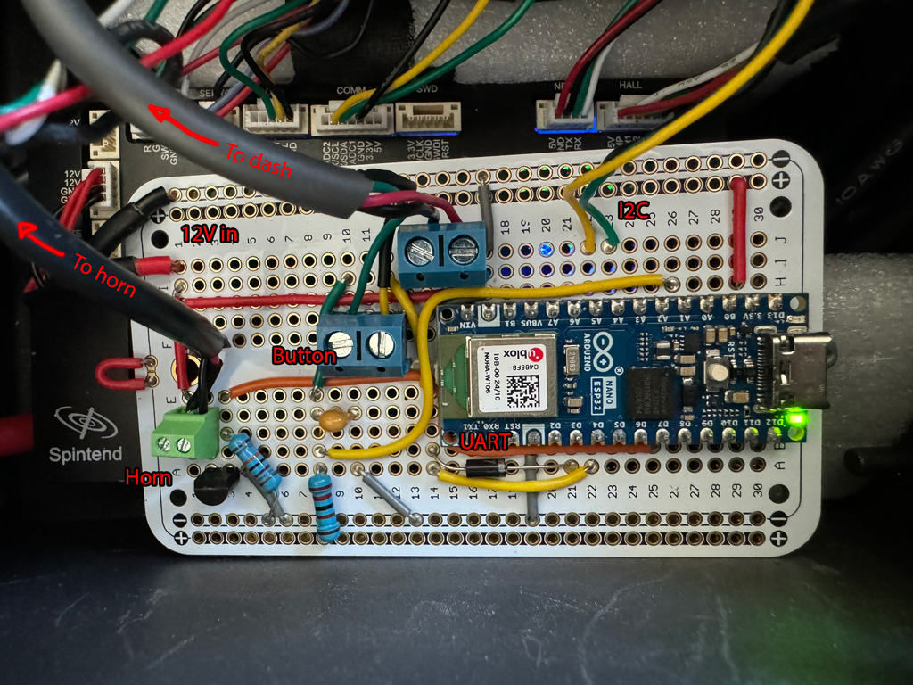

# VESC Ninebot Max G2
## Background
Code and information to support (eventually) full-featured Ninebot Max G2 operation using a VESC-based controller and an Arduino Nano ESP32. UART protocol for dash "reverse-engineered" using USB-serial sniffer and serial port monitor software, scooterhacking.org documentation on Ninebot serial protocol, and predecessor example code for Max G30 from [tonymillion](https://github.com/tonymillion/VescNinebotDash) and [the VESC team](https://github.com/m365fw/vesc_m365_dash).

I found that the VESC board I was using did not have enough processing headroom to support UART communication with the dash, a button input scanning loop, etc. all at the same time on one core while also driving the motor effectively/safely. The dash seems somewhat sensitive about timing of responses to its commands.

Adding in an ESP32-S3 based Arduino Nano ESP32 to act as a "communication hub" solved that problem.

lispBM script for VESC requires VESC firmware 6.0.5+ and VESC tool. Docs here: [bldc/lispBM/README.md](https://github.com/vedderb/bldc/blob/master/lispBM/README.md)

You will also want a GH1.25 connector kit for making connections to the VESC board. Pre-crimped wires make life easier here.

## To-do
* Cruise control
* Proper speed modes that actually do something instead of being visual only

## Hardware
This will theoretically work with all of the stock hardware, but then you might as well use SHFW or Xiaodash. The main benefit of this conversion is to let you use batteries at 60V+, as long as your BMS and VESC support it.

### Battery
I am running a custom-made 60V battery composed of 64x Samsung 50S 21700 cells in a 16S4P configuration. It fits in the stock battery compartment (barely!) but I needed to trim the tabs off of the inside of the plastic G2 battery cover so that the cover can sit flush against the battery compartment. This gives about twice the energy of the stock battery and much greater power output.

The battery is managed using a [MAXKGO VESC BMS](https://maxkgo.com/products/maxkgo-ltc6811-13-24s-70a-smart-vesc-bms-lithium-ion-battery-protection-circuit-board-for-e-scooter-e-car-e-bike-e-skateboard), which communicates with the controller via CAN. 
* It is a clone of the ENNOID BMS, so it is built to speak the VESC CAN protocol out of the box. Need to configure limits and pack config.
  * Wire H to H, L to L, Gnd to Gnd. 

### Controller
The controller I am using is the [Spintend ubox Aluminum 85V/150A](https://spintend.com/collections/esc-based-on-vesc/products/single-ubox-aluminum-controller-80v-100a-based-on-vesc).
* I am running the brake light off of the Servo/PPM port, since that supports PWM signal output and provides 5V for the brake light LEDs. The 3.3V PWM signal controlled by the lispBM script is used to bias a 2N7000 N-channel MOSFET that feeds the 5V current through the LED module.
  * +5V to brake light positive, brake light negative to FET drain, 3.3V PWM to FET gate, FET source to ground.
* The Comm port is used to communicate with the Nano ESP32 using I2C.
  * SCL to SCL, SDA to SDA, Gnd to Gnd.
* Hall port is self-explanatory. Can maintain same order of hall wires from stock cable, i.e., match up A B C with 1 2 3. Temp is white wire. Red is red, black is black, Bob's your uncle.
* Motor phase wires re-terminated with 4mm male bullet connectors to match board outputs. Same order as stock controller: blue, brown, yellow. 

This controller provides 12V outputs, which is useful because several components of the Max G2 (dash, horn) get 12VDC from the stock controller. If your board doesn't provide 12V, then you'll want a boost converter.

### Arduino
I'm using the Arduino Nano ESP32 as a communication nexus of sorts between the BLE/dash and the VESC board. There are three main tasks handled by the board:
1. Via I2C, receive updates on motor and battery status from the VESC board, send updates on throttle/brake/etc. inputs. VESC is controller/master. ESP32-S3 is peripheral/slave.
2. Via single-wire UART, receive updates on input data from the BLE/dash, send updates on speed/battery/headlight/beep etc.
   * UART Tx from dash (yellow wire) can run straight into Serial Rx for Arduino.
   * Serial Tx from Arduino feeds into the same line through a reverse-biased Schottky diode. Pullup resistor from the dash is sufficient to maintain signal integrity.
   * Horn is also driven indirectly off of UART input. If we detect a horn signal, then we drive an output pin HIGH, which biases the gate of a 2N7000 N-channel MOSFET. 220kOhm pull-down resistor to ground on the gate. Horn driver circuit is connected to +12V and the drain of the MOSFET. Source is connected to ground.
4. Receive button signal and run an input loop to detect single presses, double presses, and long presses. Adjust system state in kind.
   * Once UART comms starts running on the dash, the button line (green wire) gets super noisy, even with a pull-up resistor to bring it to logic level 3.3V. I found it to be impractical (with my current knowledge of electronics) to clean up the signal to the point where I could get a consistent digital HIGH/LOW from the button wire signal. Button has an internal 10kOhm resistor to ground when pressed. 
   * I tried buffering a decent amount with a 22kOhm pull-up resistor attached to +3.3V, then a 470nF ceramic capacitor to bridge the button line and ground. This was enough to allow analogRead() to reliably detect button down, since the voltage on button down was below the low range of the voltage swings that occur when the button is up. Not ideal, but it works fine.

### Prototype wiring example

GPIO config:
* D3 - UART Tx (reverse Schottky diode connected to dash yellow)
* D4 - UART Rx (dash yellow)
* A4 - I2C SDA (VESC Comm SDA)
* A5 - I2C SCL (VESC Comm SCL)
* A1 - Button sense (dash green with pull-up resistor to 3.3v, capacitor bridged to ground)
* D7 - Horn transistor bias out 3.3V (gate of 2N7000 N-channel MOSFET)

## Software & serial protocol notes
* C++ Arduino sketch to drive Arduino Nano ESP32 (Ninebot Max G2 ESP32.ino) communication with dash and VESC
* lispBM script to drive VESC communication with dash
  * Supports thermal management: reduce current above threshold temperature to prevent overheat
  * Supports launch boost: if not in thermal management, then allow boost current at low speed to assist acceleration from standstill
* G2 BLE to ESC serial protocol is very similar to that for the G30 etc., but the number of data bytes in a packet differs. For example, the ESC response to BLE for command 0x64 has 8 bytes in the payload for the G2 as opposed to 6 bytes for the G30.
* The 11th overall byte in the packet from BLE to ESC is used to transmit:
  * horn on (0x60)
  * turn signal held for 3 seconds (0x50)
    * sent in exactly one packet! can be in 0x64 packets as well as 0x65, so you need to capture and handle all incoming input data to catch this reliably
  * baseline (0x40)
* In packet from ESC to BLE, lamp status byte encodes headlamp (bit 1), park (bit 2) and cruise (bit 3).
  * The fourth to last bit (second to last before the two checksum bytes) is 0x04 instead of 0x06 when in cruise, but I don't really know what this byte does apart from that.
